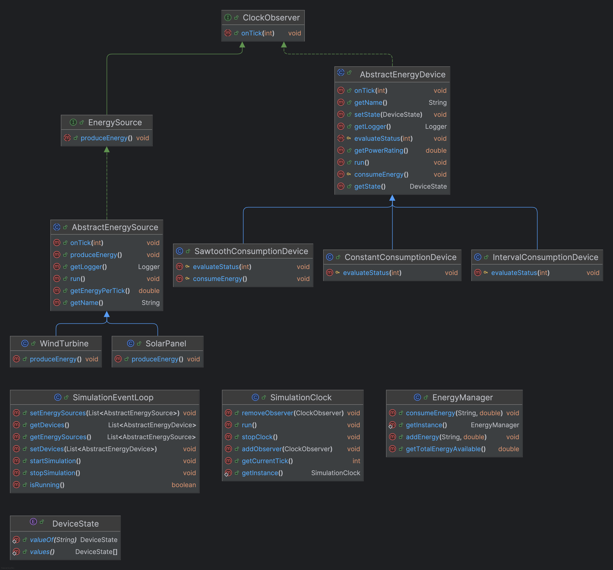

# Energy Management System - Capstone Project
## Java Pre-Course Home Assignment: Basic I/O and Regular Expressions
### Matriculation Number: 7222363

### Prerequisites

- Java 11 or later
- Maven
- A web browser for viewing the interface

### Setup & Running the Project
1. Clone the Repository:
    ```sh
    git clone https://github.com/theadell/ese-smart-home-capstone.git
    cd ese-smart-home-capstone
    ```
2. Build the Project:
    ```sh
    ./mvnw package Dquarkus.package.jar.type=uber-jar 
    ```
3. Run
   ```sh
   java -jar target/*-runner.jar
   ```
4. Access the Application: Open your browser and navigate to:
   ```sh
   http://localhost:8080
   ```
#### Usage 
- Click "Start Simulation" to run the simulation
- to view log file for device or source click " View log file for ..." which redirects you to the spefic log file i.e "http://localhost:8080/logs/devices/Refrigerator-001"

### Class Diagram 


