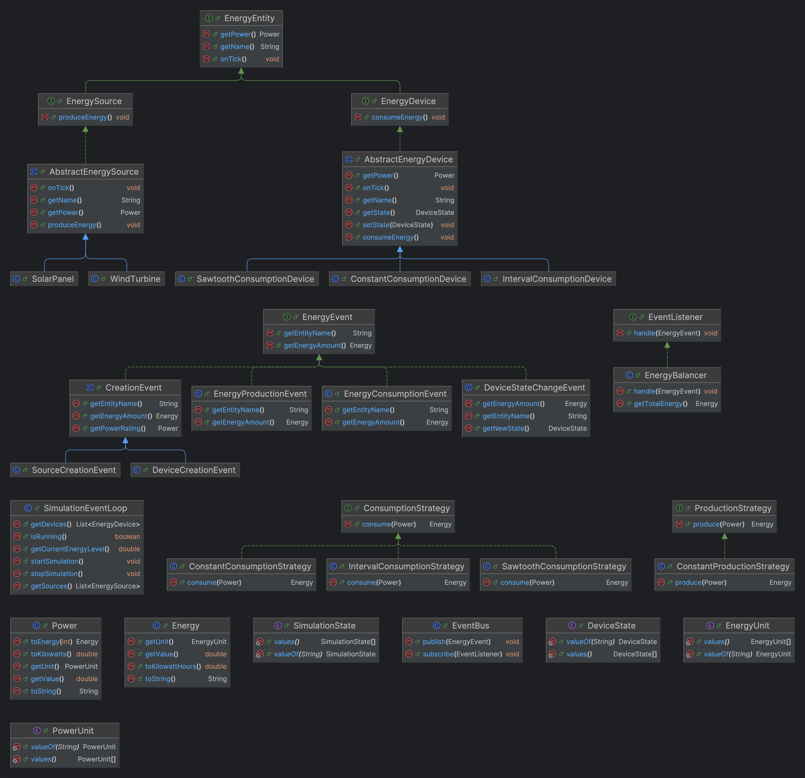

# Energy Management System - Capstone Project

## Java Pre-Course Home Assignment: Basic I/O and Regular Expressions

### Matriculation Number: 7222363

### Overview

This project simulates smart home devices, allowing users to monitor and manage energy consumption. The system runs a simulation of various energy devices and produces log files that track their activity. 

**Try the online demo here:** [Online Demo](https://ese-java-project.adelhub.com/)

### Prerequisites

- Java 21 or later
- Maven
- A web browser for viewing the application

### Setup & Running the Project

1. **Clone the Repository:**
    ```sh
    git clone https://github.com/theadell/ese-smart-home-capstone.git
    cd ese-smart-home-capstone
    ```

2. **Build the Project:**
    ```sh
    ./mvnw package -Dquarkus.package.jar.type=uber-jar 
    ```

3. **Run the Application:**
    ```sh
    java -jar target/*-runner.jar
    ```

4. **Access the Application:** Open your browser and navigate to:
    ```sh
    http://localhost:8080
    ```

### Usage

- Click **"Start Simulation"** to begin the simulation.
- To view log files for specific devices or energy sources, click **"View log file for..."**. This will redirect you to the corresponding log file, such as `http://localhost:8080/logs/devices/Refrigerator-001`.

### Project Structure

The project is organized into two main directories: `src/lib/simulation` for simulation logic and `src/web` for web-related components. 

- **lib/simulation**: Contains the core simulation logic and classes 
- **web**: Contains the web-related resources for user interface, including REST endpoints

### Available Endpoints

- **Simulation Control:**
    - `POST /simulation/start`: Starts the simulation.
    - `POST /simulation/stop`: Stops the simulation.
    - `GET /simulation/status`: Checks the current status of the simulation.
    - `GET /simulation/devices`: Retrieves the list of devices.
    - `GET /simulation/sources`: Retrieves the list of energy sources.
    - `GET /simulation/energy`: Retrieves the current energy level.

- **Log Management:**
    - `GET /logs/search`: Searches log files based on a query.
    - `GET /logs/devices/{deviceName}`: Retrieves logs for a specific device.
    - `GET /logs/devices/{deviceName}/page`: Retrieves logs for a specific device with pagination.

### Class Diagram


